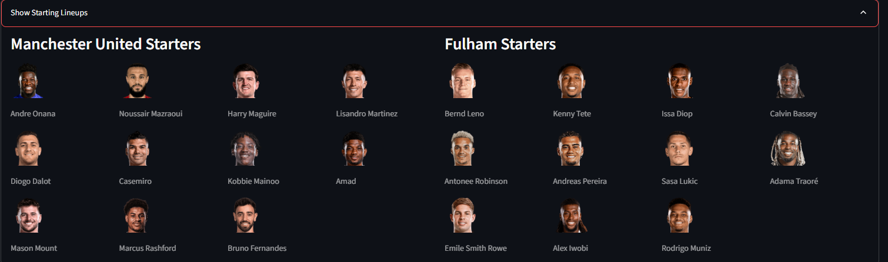

# EPL Fotmob Data Visualizations

This project showcases an end-to-end data engineering pipeline that extracts, processes, and visualizes English Premier League (EPL) data from Fotmob. The pipeline is built using a modern data stack, including Python, Apache Airflow, Docker, Terraform, Google Cloud Platform (GCP), PySpark, and Streamlit.

## Project Overview

The project is designed to provide soccer fans and data analysts with a comprehensive platform to explore EPL data. It features interactive dashboards for visualizing shot maps, comparing player statistics, and analyzing match facts.

<details>
<summary>Table of Contents</summary>

- [Features](#features)
- [Architecture](#architecture)
- [Data Pipeline](#data-pipeline)
- [Infrastructure as Code](#infrastructure-as-code)
- [Streamlit Dashboard](#streamlit-dashboard)
- [Setup and Installation](#setup-and-installation)
- [Usage](#usage)
- [Future Work](#future-work)

</details>

## Features

- **Automated Data Extraction**: The pipeline automatically extracts data from Fotmob using a Python script.
- **Cloud-Based Data Processing**: Data is processed in the cloud using a Dataproc cluster on GCP.
- **Dimensionally Modeled Data Warehouse**: The processed data is stored in a Supabase PostgreSQL database with a dimensional model.
- **Interactive Dashboards**: The project features interactive dashboards built with Streamlit for visualizing the data.

## Architecture

The project follows a modern data architecture, with a clear separation of concerns between data extraction, processing, and visualization.

  <!-- You might want to create and add an architecture diagram here -->

<details>
<summary>Expand for more details</summary>

The architecture consists of the following components:

- **Data Source**: Fotmob provides the raw data for the project.
- **Data Extraction**: A Python script is used to extract the data from Fotmob.
- **Data Lake**: The extracted data is stored in a Google Cloud Storage (GCS) bucket.
- **Data Processing**: An Apache Spark job running on a Dataproc cluster is used to process the data.
- **Data Warehouse**: The processed data is stored in a Supabase PostgreSQL database with a dimensional model.
- **Data Visualization**: A Streamlit application is used to visualize the data, leveraging SQL views for efficient data retrieval.

</details>

## Data Pipeline

The data pipeline is orchestrated using Apache Airflow. It consists of a series of tasks that extract, load, and transform the data.

<details>
<summary>Expand for more details</summary>

The data pipeline consists of the following steps:

1.  **Extract Data**: A Python script extracts the data from Fotmob and saves it as JSON files.
2.  **Load to Staging**: The JSON files are loaded into a GCS bucket.
3.  **Process Data**: A Dataproc job reads the JSON files from the GCS bucket, processes them, and appends the data to staging tables in the PostgreSQL database.
4.  **Merge to Dimensions and Facts**: The data from the staging tables is then inserted into the dimensionally modeled tables in the PostgreSQL database.

The Airflow DAG for the pipeline is defined in `airflow/dags/dag_script.py`.

</details>

## Infrastructure as Code

The cloud infrastructure for the project is managed using Terraform. This allows for the automated and repeatable provisioning of the required resources on GCP.

<details>
<summary>Expand for more details</summary>

The Terraform configuration files are located in the `terraform` directory. The `main.tf` file defines the following resources:

-   **GCS Bucket**: A GCS bucket is created to store the raw data.
-   **Dataproc Cluster**: A Dataproc cluster is created to process the data.

To apply the Terraform configuration, run the following commands:

```bash
cd terraform
terraform init
terraform apply
```

</details>

## Streamlit Dashboard

The project features a multi-page Streamlit application for visualizing the data. The application is organized into several dashboards, each focusing on a different aspect of the data.

### Shot Map Dashboard

The Shot Map Dashboard allows you to visualize the shots taken by a specific player in a given match.


### Player Comparison Pizza Plots

The Player Comparison Pizza Plots allow you to compare the statistics of two players using pizza plots.


### Match Facts Dashboard

The Match Facts Dashboard provides a comprehensive overview of a specific match, including team shot maps, xG race plots, momentum charts, and top player stats.




## Setup and Installation

To set up the project locally, you will need to have Docker and Docker Compose installed.

<details>
<summary>Expand for more details</summary>

1.  **Clone the repository**:

    ```bash
    git clone https://github.com/your-username/EPL_Fotmob.git
    cd EPL_Fotmob
    ```

2.  **Set up environment variables**:

    Create a `.env` file in the root of the project and add the following environment variables. You will need to get the Supabase connection details from your Supabase project settings.

    ```
    GCP_PROJECT_ID=<your-gcp-project-id>
    GCP_REGION=<your-gcp-region>
    GCS_BUCKET_NAME=<your-gcs-bucket-name>
    DB_CONNECTION_STRING=<your-supabase-db-connection-string>
    ```

3.  **Build and run the Docker containers**:

    ```bash
    docker-compose up --build
    ```

This will start the following services:

-   `airflow-webserver`: The Airflow web server.
-   `airflow-scheduler`: The Airflow scheduler.

</details>

## Usage

1.  **Access the Airflow UI**:

    Open your web browser and navigate to `http://localhost:8080` to access the Airflow UI. You can trigger the `epl_data_pipeline` DAG to start the data pipeline. This will extract the data, process it, and load it into your Supabase database.

2.  **Create SQL Views**:

    After the data pipeline has successfully run, you will need to create the SQL views in your Supabase database. You can do this by running the `CREATE OR REPLACE VIEW` statements from `airflow/dags/sql_create_scripts.sql` in the Supabase SQL editor.

3.  **Run the Streamlit Dashboard**:

    Once the views are created, you can run the Streamlit application:

    ```bash
    streamlit run streamlit/app.py
    ```

    Open your web browser and navigate to `http://localhost:8501` to access the Streamlit dashboard.

## Future Work

-   Add more visualizations to the Streamlit dashboard.
-   Add support for other soccer leagues.
-   Use dbt for sql views and unit testing for the data pipeline.
